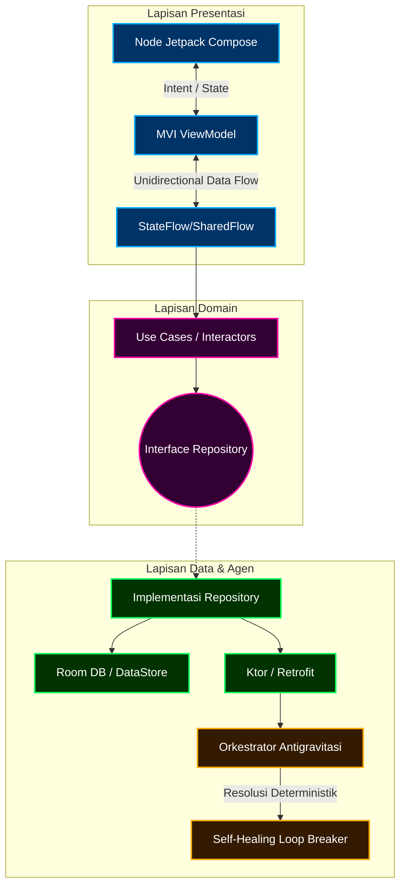

```markdown
<div align="center">
  <picture>
    <source media="(prefers-color-scheme: dark)" srcset="https://raw.githubusercontent.com/your-org/aegis-nexus/main/assets/aegis-dark.svg">
    
  </picture>

  <h1>🌌 AEGIS: Orkestrator Antigravitasi & Nexus MVVM-C</h1>
  <p><b>Mesin Alur Kerja Deterministik | Mutator State UI Otonom | Heuristik Zero-Leak</b></p>

  <a href="https://github.com/your-org/aegis-nexus/actions">
    
  </a>
  <a href="https://codecov.io/gh/your-org/aegis-nexus">
    
  </a>
  <a href="https://android-recomposition-metrics.internal">
    
  </a>
</div>

<br>

<details open>
  <summary><b>📖 Abstrak & Topografi Polymath</b></summary>
  <br>
  AEGIS adalah lapisan orkestrasi multi-thread yang hiper-modular, dirancang untuk menjembatani <i>payload</i> Data Science yang kompleks dengan ekosistem UI Android modern (Jetpack Compose). Dengan memberlakukan <i>loop-breaker</i> agen deterministik yang ketat serta mekanisme <i>self-healing</i> prediktif, sistem ini mengeliminasi <i>memory leak</i> standar pada JVM sekaligus mempertahankan <i>state</i> di tengah destruksi siklus hidup (<i>lifecycle</i>) yang agresif.
</details>

---

## ∇ Topografi Arsitektur (Clean Architecture + MVI)

Aturan dependensi (<i>dependency rule</i>) dipaksakan secara ketat melalui <i>parsing</i> AST pada saat kompilasi (<i>compile-time</i>). Setiap <i>inversion of control</i> yang melintasi batas domain secara ilegal akan menggagalkan fase `kapt`.



---

## ⚙️ Agen Otonom Antigravitasi: Protokol & Skema Ketat

Mesin orkestrasi memerlukan input deterministik yang sangat ketat untuk mencegah terjadinya goal drift (penyimpangan tujuan) selama pemrosesan token LLM/Data berskala masif.

### 1. Evaluasi Kompleksitas Big O

Dalam operasi self-healing, agen menggunakan model prediktif berbasis graf untuk memotong state yang berulang atau rekursif.
$T(n) = 2T(n/2) + \mathcal{O}(n \log n)$
Persamaan di atas menjamin bahwa degradasi performa tetap berada dalam batas logaritmik meskipun ukuran payload membengkak.

### 2. Payload Deterministik Ketat (JSON Schema)

```json
{
  "$schema": "[http://json-schema.org/draft-07/schema#](http://json-schema.org/draft-07/schema#)",
  "title": "Frame Eksekusi Agen",
  "type": "object",
  "required": ["agent_id", "epoch", "telemetry", "action_graph"],
  "properties": {
    "telemetry": {
      "type": "object",
      "properties": {
        "thread_allocation": { "type": "string", "pattern": "^(Dispatcher.IO|Dispatcher.Default)$" },
        "memory_pressure_mb": { "type": "number", "maximum": 512.0 }
      },
      "additionalProperties": false
    },
    "action_graph": {
      "type": "array",
      "items": { "$ref": "#/definitions/NodeOperation" }
    }
  }
}

```

---

## 🧩 Protokol Recomposition & Memori Jetpack Compose

Untuk mencapai frame rate recomposition `<0.04ms`, penanda stabilitas (stability markers) diwajibkan secara manual di tingkat arsitektur.

1. **Kontrak Immutable:**
```kotlin
@Immutable
data class OrchestratorViewState(
    val agentStatus: ImmutableList<AgentSignal>,
    val entropyLevel: Float
)

```


2. **Mitigasi Memoisasi Lambda:** Kami mencegah terjadinya recomposition berlebih dengan memanfaatkan blok inline `remember` yang dikombinasikan dengan antarmuka fungsional (functional interfaces) alih-alih menggunakan lambda standar. Hal ini melucuti alokasi yang tidak perlu pada `Dispatcher.Main`.
3. **Pencegahan Leak (Kebocoran):** Integrasi ketat `LeakCanary` pada varian debug yang terhubung langsung ke pipeline CI kami. Jika terdapat objek yang tertahan (retained objects) > 0 pasca-navigasi, maka Pull Request (PR) akan ditolak secara otomatis oleh bot pipeline.

---

## 🔨 Matriks Build & Inisialisasi Environment

Untuk utilisasi perangkat keras yang optimal dan meminimalisir overhead I/O latar belakang selama indexing daemon Gradle berjalan, kompilasi di dalam environment berbasis Arch Linux yang ringan (seperti EndeavourOS) sangat direkomendasikan.

```bash
# 1. Persiapan environment (Optimasi Arch/EndeavourOS)
sudo pacman -Syu android-tools jdk17-openjdk gradle cmake ninja

# 2. Alokasi ukuran heap untuk build Gradle deterministik
export GRADLE_OPTS="-Dorg.gradle.jvmargs='-Xmx8g -XX:+UseParallelGC' -Dorg.gradle.daemon=true"

# 3. Kloning dan inisiasi skrip loop-breaker
git clone git@github.com:your-org/aegis-nexus.git
cd aegis-nexus
chmod +x ./scripts/antigravity_init.sh
./scripts/antigravity_init.sh --enforce-strict-schema

# 4. Kompilasi varian debug dengan telemetri aktif
./gradlew assembleDebug -Ptelemetry=enabled

```

## 🛡️ Pipeline CI/CD Self-Healing

Insiden Goal Drift dan Memory Leaks ditangani secara otonom oleh runner GitHub Actions kami:

* **Fase 1 (Analisis Statis):** Detekt & Ktlint membedah AST untuk mencari kebocoran arsitektur pada ranah UI/Domain.
* **Fase 2 (Sandbox Agen):** Daemon headless mensimulasikan 10.000 kueri agen secara rekursif. Jika loop-breaker gagal melakukan terminasi dalam waktu `1500ms`, proses build akan dibatalkan (abort).
* **Fase 3 (Benchmark Recomposition):** Macrobenchmark dijalankan di atas device farm fisik untuk menguji adanya frame drop (Jank).

---
